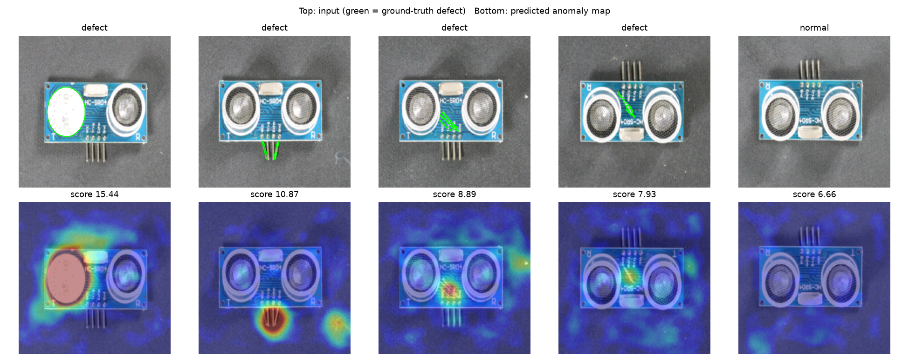
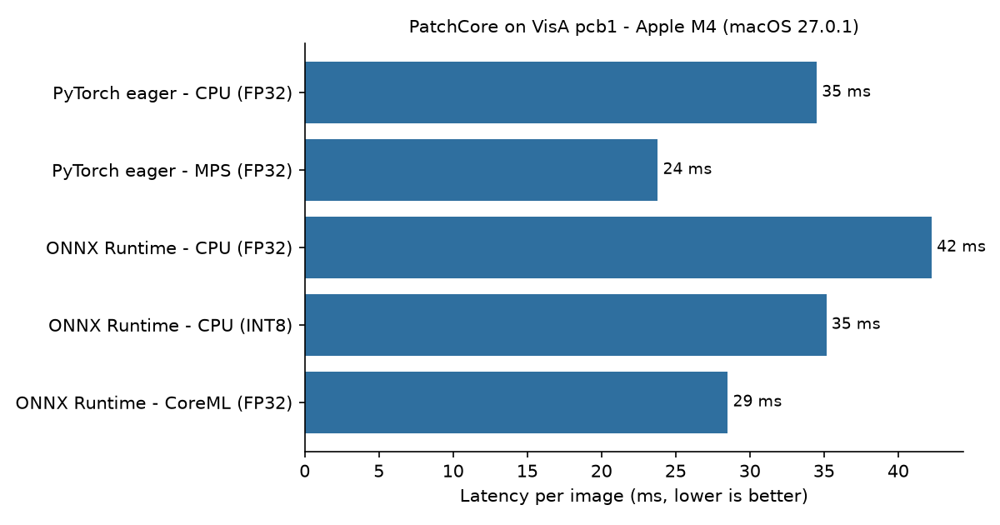

# Edge Anomaly Inspection

Unsupervised visual defect detection for industrial parts, packaged as a **single ONNX model** and benchmarked across CPU, GPU and Apple CoreML backends, with each backend's speed reported next to its accuracy.

The model learns only from images of good parts, so it works in the common factory situation where defect examples are rare or don't exist yet. It returns both a pass/fail score and a heatmap showing where the defect is.



## What's in it

- **Method:** PatchCore (Roth et al., CVPR 2022). Patch features from a frozen ImageNet backbone (WideResNet-50) are stored in a memory bank, reduced with greedy coreset selection. A test patch is scored by its distance to the nearest normal patch. No training on defect images.
- **One-file deployment:** backbone, feature projection and nearest-neighbour scoring are exported together into one ONNX graph: image in, anomaly map out. No Python model code needed on the target device.
- **INT8 quantization:** static post-training quantization (QDQ, per-channel) of the backbone convolutions, calibrated on normal images. The distance computation stays in FP32 to protect accuracy.
- **Benchmark:** the same 200-image test set (100 defective) runs through every backend, so each backend's latency is reported next to its accuracy (image- and pixel-level AUROC).
- **Jetson path:** `jetson/build_trt.sh` builds a TensorRT FP16 engine from the same ONNX file with `trtexec`.

## Results

<!-- RESULTS:START -->
Machine: Apple M4 (macOS 27.0.1) | threads: 5 | batch 1 | input 224x224 | backbone wide_resnet50_2 | memory bank 7087 patches

| Backend | Mean latency (ms) | p95 (ms) | FPS | Speed-up | Image AUROC | Pixel AUROC | Model size (MB) |
|---|---:|---:|---:|---:|---:|---:|---:|
| PyTorch eager - CPU (FP32) | 34.5 | 35.3 | 29.0 | 1.00x | 0.936 | 0.995 | - |
| PyTorch eager - MPS (FP32) | 23.8 | 24.1 | 42.0 | 1.45x | 0.936 | 0.995 | - |
| ONNX Runtime - CPU (FP32) | 42.3 | 43.2 | 23.7 | 0.82x | 0.936 | 0.995 | 134.7 |
| ONNX Runtime - CPU (INT8) | 35.2 | 36.0 | 28.4 | 0.98x | 0.929 | 0.994 | 60.6 |
| ONNX Runtime - CoreML (FP32) | 28.5 | 36.0 | 35.1 | 1.21x | 0.936 | 0.995 | 134.7 |

Latency = model only (image in, patch scores out), mean of repeated single-image runs after warm-up. Speed-up is relative to the first row.
<!-- RESULTS:END -->



### What the numbers show (Apple M4)

- **GPU paths are fastest.** PyTorch on MPS runs at 23.8 ms (42 FPS); the exported ONNX model on CoreML runs at 28.5 ms (35 FPS). CoreML took 116 of the graph's 128 nodes; the rest fell back to CPU.
- **On this CPU, ONNX Runtime did not beat PyTorch.** ONNX FP32 was slower (42.3 vs 34.5 ms); INT8 brought it back to parity (35.2 ms). PyTorch on Apple Silicon already uses well-tuned CPU kernels, so CPU gains from ONNX/INT8 depend on the target processor and should be measured there. `./run_all.sh` does exactly that on any machine.
- **INT8 halves the model** (134.7 MB to 60.6 MB) for a small accuracy cost (image AUROC 0.936 to 0.929; pixel AUROC 0.995 to 0.994). That matters on edge devices with limited memory or storage.
- **Accuracy:** image-level AUROC 0.936 and pixel-level AUROC 0.995 on VisA `pcb1`, at 224x224 input. The weakest cases are small defects (thin scratches, bent pins), which lose detail at this resolution; a higher input resolution is the first thing to try for those.

## Run it

```bash
git clone https://github.com/mohammadgheisari1994/edge-anomaly-inspection.git && cd edge-anomaly-inspection
./run_all.sh            # VisA pcb1 by default
./run_all.sh pcb1 pcb2  # or several categories
```

This creates a virtual environment, downloads the dataset, fits the model, exports and quantizes it, then writes `results/<category>/`:

| File | Content |
|---|---|
| `results.md` / `results.json` | latency, FPS, speed-up, AUROC and model size per backend |
| `latency.png` | latency comparison chart |
| `examples.png` | detected defects with heatmaps vs ground truth |
| `patchcore_fp32.onnx`, `patchcore_int8.onnx` | deployable models |

Quick check without the dataset (random weights, synthetic images): `python tests/smoke_test.py`

### Backends compared

| Backend | Notes |
|---|---|
| PyTorch eager, CPU | baseline |
| PyTorch eager, MPS / CUDA | if available |
| ONNX Runtime, CPU FP32 | graph optimisations on |
| ONNX Runtime, CPU INT8 | static QDQ quantization |
| ONNX Runtime, CoreML / CUDA | if available |
| TensorRT FP16 (Jetson) | `jetson/build_trt.sh`, run separately on the device |

## Project layout

```
edgeanom/model.py     PatchCore model, exportable feature projection, coreset selection
edgeanom/pipeline.py  fit -> export -> quantize -> evaluate -> benchmark
edgeanom/report.py    results table, charts, example heatmaps
edgeanom/data.py      VisA loader
jetson/build_trt.sh   TensorRT engine build for Jetson
tests/smoke_test.py   end-to-end test on synthetic data
```

## Dataset and licence

Uses the [VisA dataset](https://github.com/amazon-science/spot-diff) (Zou et al., ECCV 2022) by Amazon Science, licensed under [CC BY 4.0](https://creativecommons.org/licenses/by/4.0/). The dataset is downloaded at run time and is not redistributed in this repository.

Code: MIT licence.
